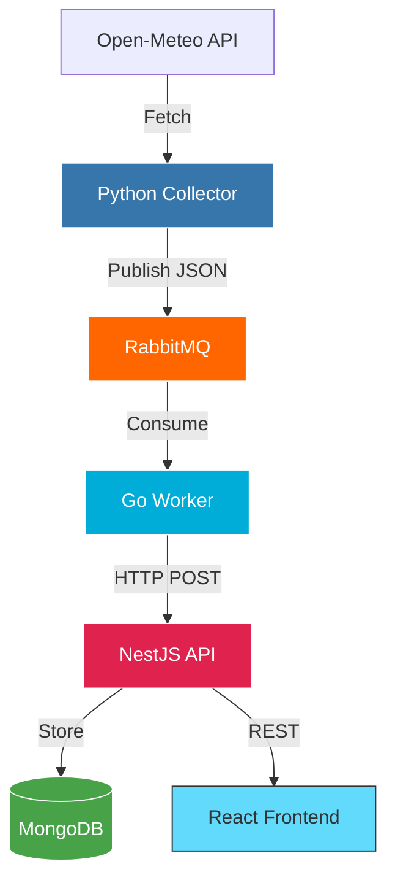
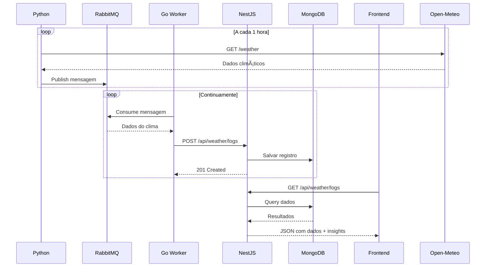

## ðŸ—ï¸ Arquitetura do Sistema

```mermaid
graph TB
    A[Python Collector] -->|Publish JSON| B[RabbitMQ]
    B -->|Consume| C[Go Worker]
    C -->|HTTP POST| D[NestJS API]
    D -->|Store| E[(MongoDB)]
    D -->|REST| F[React Frontend]
    G[Open-Meteo API] -->|Fetch| A

    style A fill:#3776ab,stroke:#fff,color:#fff
    style B fill:#ff6600,stroke:#fff,color:#fff
    style C fill:#00add8,stroke:#fff,color:#fff
    style D fill:#e0234e,stroke:#fff,color:#fff
    style E fill:#47a248,stroke:#fff,color:#fff
    style F fill:#61dafb,stroke:#333,color:#333
```
### 📊 Fluxo de Dados

```mermaid
sequenceDiagram
    participant P as Python
    participant R as RabbitMQ
    participant G as Go Worker
    participant N as NestJS
    participant M as MongoDB
    participant F as Frontend

    loop A cada 1 hora
        P->>Open-Meteo: GET /weather
        Open-Meteo-->>P: Dados climáticos
        P->>R: Publish mensagem
    end
    
    loop Continuamente
        G->>R: Consume mensagem
        R-->>G: Dados do clima
        G->>N: POST /api/weather/logs
        N->>M: Salvar registro
        N-->>G: 201 Created
    end
    
    F->>N: GET /api/weather/logs
    N->>M: Query dados
    M-->>N: Resultados
    N-->>F: JSON com dados + insights
```
